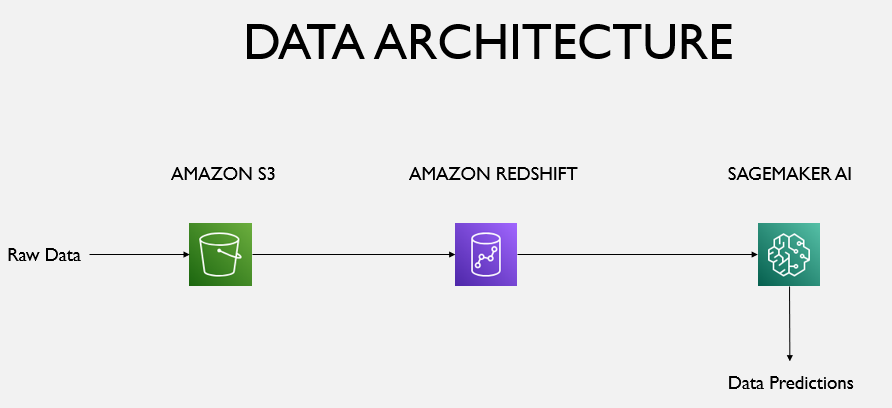
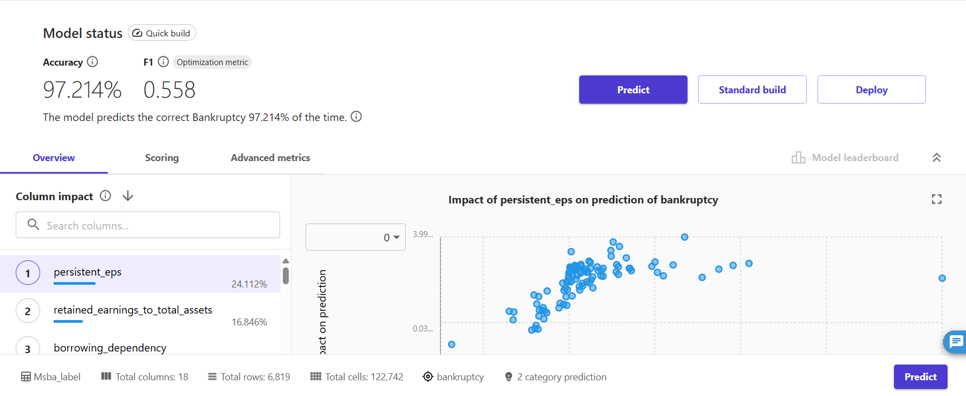
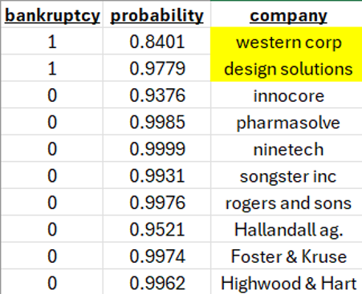

## Background
This project is an end-to-end data pipeline built during my **Business Analytics (MSBA) program**. The goal was simple: use cloud infrastructure to predict if a company is headed toward bankruptcy based on its financial health.

  
   
  <i>Figure 1: Data Architecture Diagram.</i>

---

## Methods and Tools
I built the architecture using **AWS** to keep everything scalable and organized:
* **Amazon S3**: My "data lake" where raw files and final prediction reports live.
* **Amazon Redshift**: The heavy lifter for data warehousing. I used SQL to build tables and `COPY` commands to pull data in from S3.
* **SageMaker AI**: Where the magic happens. I used this for exploratory data analysis and to train the actual machine learning model.

1.  **Data Setup**: Raw financial data gets dumped into S3 buckets like `msba-data-prototype`.
2.  **SQL Wrangling**: I initialized a `bankrupt` table in Redshift and mapped out the schema, including company names and bankruptcy status.
3.  **The Model**: 
    * I ran a **2-category prediction** model to classify companies. 
---

## Results
The model was able to predict bankruptcy with **97.214% accuracy**. Out of all the companies in the data, two companies were overwhemlingly predicted to go bankrupt which were western corp and design solutions as shown below: 

  
   
  <i>Figure 5: Sagemaker Initial Results.</i>

  
   
  <i>Figure 6: Bankruptcy Prediction Results.</i>

Something of note that was discovered during the modeling process was that `persistent_eps` and `retained_earnings_to_total_assets` are the biggest indicators for a failing company. This can be useful information for future use of similar bankruptcy predictions.
