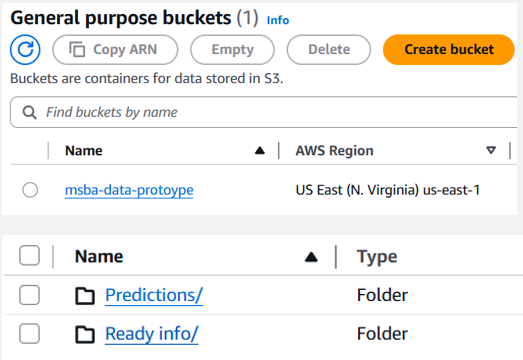
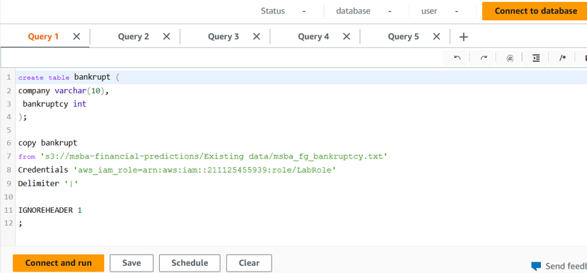
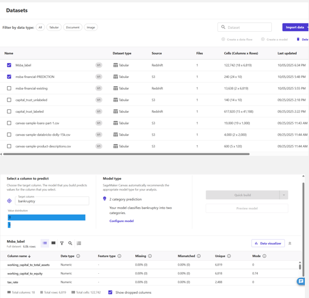

[**Home**](https://am-msba.github.io/Portfolio/) | [**MIP Optimizer**](https://am-msba.github.io/MIP_Optimization_Solver/) | [**ML Prediction Modeling**](https://am-msba.github.io/Machine_Learning_Prediction_Project/) 

## Background
This project is an end-to-end data pipeline built using Amazon's AWS cloud capabilities. The goal was to use the cloud infrastructure to predict if a company is headed toward bankruptcy based on its financial health from given raw data.

  
   
  <i>Figure 1: Data Architecture Diagram.</i>

---

## Methods and Tools
I built the architecture using **AWS** to keep everything scalable and organized:
* **Amazon S3**: My "data lake" where raw data is stored in S3 buckets such as `msba-data-prototype`.

  
   
  <i>Figure 2: S3 Setup.</i>

* **Amazon Redshift**: I used SQL queries to build tables and `COPY` commands to pull data in from the respective S3 buckets.

  
   
  <i>Figure 3: Redshift SQL Queries.</i>

* **SageMaker AI**: I used this for exploratory data analysis and to train the actual machine learning model.
  * **The Model**: I ran a **2-category prediction** model to classify companies as either bankrupt (1) or not bankrupt (0).

  
   
  <i>Figure 5: Sagemaker Model Setup.</i>

---

## Results
The model was able to predict bankruptcy with **97.214% accuracy**. Out of all the companies in the data, two companies were overwhemlingly predicted to go bankrupt which were Western Corp and Design Solutions as shown below: 

  
   
  <i>Figure 5: Sagemaker Initial Results.</i>

  
   
  <i>Figure 6: Bankruptcy Prediction Results.</i>

Something of note that was discovered during the modeling process was that `persistent_eps` and `retained_earnings_to_total_assets` are the biggest indicators for a failing company. This can be useful information for future use of similar bankruptcy predictions.
